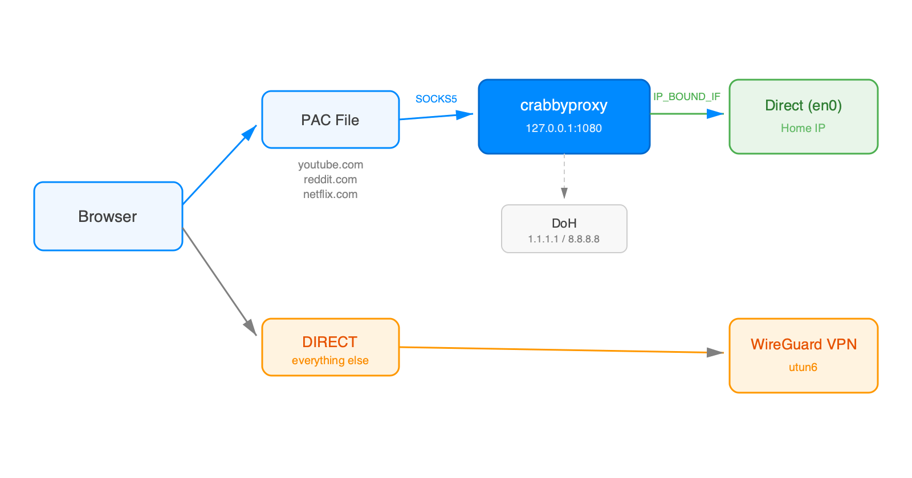

# crabbyproxy 🦀

> Named for [Ferris](https://rustacean.net/), Rust's unofficial crab mascot.

Lightweight Rust SOCKS5 proxy that binds outgoing connections to a specific network interface via macOS `IP_BOUND_IF`, enabling domain-based split tunneling where IP-based routing falls short.

Built for WireGuard on macOS, where the Network Extension intercepts all packets before the routing table — making traditional split tunneling (`AllowedIPs`, `route add`) unreliable for domain-based exclusions.

## Why?

When running a VPN for security testing, bug bounty, or general privacy, certain sites block or restrict traffic from known VPN/datacenter IP ranges (CAPTCHAs, bot checks, degraded service). For sites like YouTube or Reddit, anonymization isn't a priority — and it may actually be preferable to keep personal traffic off VPN IPs that are associated with security testing. crabbyproxy lets you selectively route specific domains through your home connection while keeping everything else tunneled.

## How it works



1. Browser PAC file routes target domains to the local SOCKS5 proxy
2. Proxy resolves DNS via DoH — bypasses VPN DNS, gets geo-correct CDN IPs
3. Proxy binds outgoing sockets to the physical interface (`IP_BOUND_IF`)
4. macOS honors the binding even with VPN active — traffic goes direct
5. All other traffic goes through the VPN as normal

## Features

- **Domain-based split tunneling** — route by domain, not IP ranges
- **DNS-over-HTTPS** — Cloudflare, Google, and Quad9 with automatic fallback
- **TTL-aware DNS cache** — minimal DoH queries
- **Interface auto-detection** — finds en0/en6/en1 automatically
- **Zero config WireGuard** — no AllowedIPs changes, no PostUp/PostDown
- **PAC file HTTP server** — serves proxy.pac over HTTP on port 1081 (Chrome compatible)
- **LaunchAgent** — starts at login, auto-restarts on crash
- **~2MB binary** — async Rust with tokio

## Install

### From source

```bash
git clone https://github.com/digital-shokunin/crabbyproxy.git
cd crabbyproxy
./install.sh
```

This builds the binary, installs it to `~/.local/bin/`, sets up default configs, and starts the LaunchAgent.

### Manual

```bash
cargo build --release
cp target/release/crabbyproxy ~/.local/bin/
mkdir -p ~/.config/crabbyproxy
cp doh.conf.default ~/.config/crabbyproxy/doh.conf
cp proxy.pac ~/.config/crabbyproxy/proxy.pac
cp com.digisho.crabbyproxy.plist ~/Library/LaunchAgents/
launchctl bootstrap gui/$(id -u) ~/Library/LaunchAgents/com.digisho.crabbyproxy.plist
```

## Browser setup

Set the automatic proxy configuration URL:

- **Firefox**: Settings > Network Settings > Automatic proxy configuration URL
  ```
  file:///Users/YOUR_USERNAME/.config/crabbyproxy/proxy.pac
  ```
- **Chrome/Safari**: System Settings > Network > Wi-Fi > Details > Proxies > Automatic Proxy Configuration
  ```
  http://127.0.0.1:1081/proxy.pac
  ```
  Chrome blocks `file://` PAC URLs for security reasons. crabbyproxy serves the PAC file over HTTP on port 1081 for Chrome compatibility.

## Configuration

### Adding domains to bypass VPN

Edit `~/.config/crabbyproxy/proxy.pac`:

```javascript
function FindProxyForURL(url, host) {
  if (shExpMatch(host, "*.youtube.com") ||
      shExpMatch(host, "*.example.com"))  // add your domains
    return "SOCKS5 127.0.0.1:1080";
  return "DIRECT";
}
```

### DoH servers

Edit `~/.config/crabbyproxy/doh.conf` (one URL per line, tried in order):

```
https://1.1.1.1/dns-query
https://8.8.8.8/dns-query
https://9.9.9.9:5053/dns-query
```

Restart after changes: `launchctl kickstart -k gui/$(id -u)/com.digisho.crabbyproxy`

## Why not just use AllowedIPs?

WireGuard's `AllowedIPs` is IP-based, not domain-based. Services like YouTube use thousands of dynamic CDN IPs across dozens of subnets. Excluding them all creates hundreds of CIDR ranges that can break the tunnel. The macOS WireGuard app's Network Extension also intercepts packets before the routing table, making `route add` commands ineffective.

crabbyproxy operates at the application layer (browser proxy) instead of the network layer, sidestepping these limitations entirely.

## Uninstall

```bash
launchctl bootout gui/$(id -u)/com.digisho.crabbyproxy
rm ~/.local/bin/crabbyproxy
rm ~/Library/LaunchAgents/com.digisho.crabbyproxy.plist
rm -rf ~/.config/crabbyproxy
```

## License

[MIT](LICENSE)
